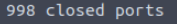
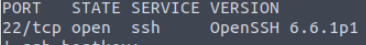
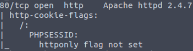

# Try Hack Me Room: NMAP
https://tryhackme.com/room/rpnmap


# Task 3

First, how do you access the help menu?
````-h````

Often referred to as a stealth scan, what is the first switch listed for a 'Syn Scan'?
````-sS````

Not quite as useful but how about a 'UDP Scan'?
```-sU```

What about operating system detection?
```-O```

How about service version detection? 
```-sV```

Most people like to see some output to know that their scan is actually doing things, what is the verbosity flag?
```-v```

What about 'very verbose'? (A personal favorite)
```-vv```

Sometimes saving output in a common document format can be really handy for reporting, how do we save output in xml format?
```-oX```

Aggressive scans can be nice when other scans just aren't getting the output that you want and you really don't care how 'loud' you are, what is the switch for enabling this? 
```-A```

How do I set the timing to the max level, sometimes called 'Insane'?
``-T5``

What about if I want to scan a specific port?
`-p`

How about if I want to scan every port?
`-p-`

What if I want to enable using a script from the nmap scripting engine? For this, just include the first part of the switch without the specification of what script to run.
`--script`

What if I want to run all scripts out of the vulnerability category? 
`--script vuln`

What switch should I include if I don't want to ping the host?
`-Pn`

# Task 4 

Let's go ahead and start with the basics and perform a syn scan on the box provided. What will this command be without the host IP address?

`nmap -sS`
After scanning this, how many ports do we find open under 1000?
`1000 - 998 = 2`



What communication protocol is given for these ports following the port number?

`tcp`

Perform a service version detection scan, what is the version of the software running on port 22?
Run the command: 
`nmap -sV <target-ip>`



Answer: `6.6.1p1`

Perform an aggressive scan, what flag isn't set under the results for port 80?

Run the command 
`nmap -A <target-ip>`


Answer: `httponly`

Perform a script scan of vulnerabilities associated with this box, what denial of service (DOS) attack is this box susceptible to? 

Run the command:

`nmap -script vuln <target-ip>`

![vuln] (img/thm3.PNG)
